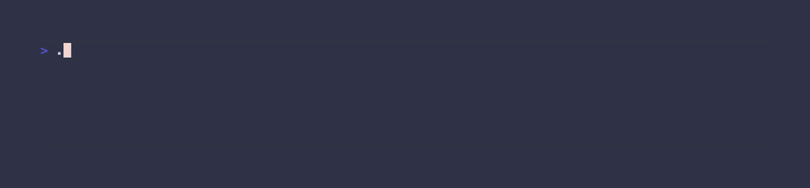

# inStyle



inStyle is a small library for quickly decorating strings with ANSI escape codes.

## Install

Run it once:

```sh
go run github.com/zphia/instyle/cmd/...@latest '[~italic]you can [~cyan]style[/] text with [~bold+magenta]inStyle[/]!!!'
```

Or install it as a tool:

```sh
go install github.com/zphia/instyle/cmd/...@latest
```

## Usage as a Library

This can be used as a library for any Go project:

```go
package main

import (
	"fmt"

	"github.com/zphia/instyle"
)

func main() {
	fmt.Println(instyle.Apply("[~italic]you can [~cyan]style[/] text with [~bold+magenta]inStyle[/]!!!"))
}
```

## Syntax

The tags follow the following format:

```
[~style]text to be styled[/]
```

Style can be a named style, or a raw value to be used in an ANSI escape code.
For example, both of these will turn the text red:

```
[~red]this text will show up as red[/]
[~31]this text will show up as red[/]
```

The ending sequence of `[/]` can be fully omitted for minor performance gains like so:

```
[~italic]ending tags need not be included
```

### Hex

Hex colour codes are supported in standard formats:

```
[~#FF4137]this text will be red[/]
```

```
[~#2e6]and this will be green[/]
```

### RGB

RGB colours can also be provided.

Spaces and values above 255 will not be understood as an RGB colour.

```
[~rgb(17,99,240)]a very blue message[/]
```

### Multiple Styles

Multiple styles can be added by using the `+` character between each style desired.

```
[~magenta+bold]this text has two styles[/]
```

### Nesting & Sequential Tags

Up to 5 tags can be nested.
All unclosed tags are terminated at the end of a string.

```
[~cyan]i never said [~bold]you[/] did that[/]... [~italic]somebody else[/] did
```

### Named Styles

<details>

<summary>Complete list of default styles.</summary>

#### Text Styling

- `plain`
- `reset`
- `bold`
- `faint`
- `italic`
- `underline`
- `blink`
- `strike`

#### Basic Colors

- `black`
- `red`
- `green`
- `yellow`
- `blue`
- `magenta`
- `cyan`
- `white`
- `default`

#### Basic Backgrounds

- `bg-black`
- `bg-red`
- `bg-green`
- `bg-yellow`
- `bg-blue`
- `bg-magenta`
- `bg-cyan`
- `bg-white`
- `bg-default`

#### Light Colors

- `light-black`
- `light-red`
- `light-green`
- `light-yellow`
- `light-blue`
- `light-magenta`
- `light-cyan`
- `light-white`

#### Light Backgrounds

- `bg-light-black`
- `bg-light-red`
- `bg-light-green`
- `bg-light-yellow`
- `bg-light-blue`
- `bg-light-magenta`
- `bg-light-cyan`
- `bg-light-white`

</details>

Aside from the named styles, additional styles can be added to a `Styler` instance by using the `Register` method.
This can be used to associated more than one ANSI escape code to a name.

```go
s := instyle.NewStyler()
s.Register("error", "1;31") // Bold and red
```

A style name can only be a maximum of 15 characters long.

## Performance

The goal for this library was to be the fastest way to apply styles to strings.
When using the functions that take an array of runes, this will only be about 3-5x slower than a plain copy of a string (even when applying styles).

And when compared a regex solution or using [Lip Gloss](https://github.com/charmbracelet/lipgloss) directly, this will perform about 5-10x faster.
